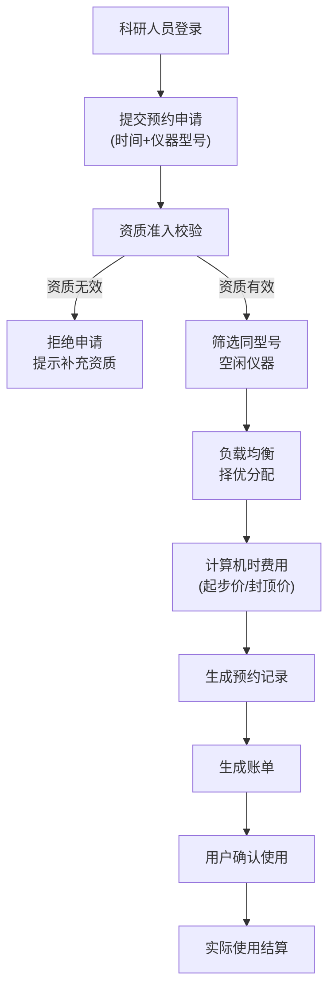

## 1. 产品概述

高校科研仪器共享桌面客户端，用于解决科研仪器资源利用率不均衡、机时计费不透明、分配效率低下等问题。科研人员只需提交使用时间需求，无需指定具体仪器，系统自动从同型号空闲仪器中择优分配，平衡各台机器负载。

- 核心用户：科研人员、仪器管理员、财务人员
- 核心价值：提升仪器利用率、简化预约流程、透明计费机制、平衡设备负载

## 2. 核心功能

### 2.1 用户角色

| 角色 | 注册方式 | 核心权限 |
|------|----------|----------|
| 科研人员 | 工号注册+资质审核 | 预约仪器、查看排期、查看账单、资质管理 |
| 仪器管理员 | 管理员账号 | 仪器建档、排期管理、资质审核、数据统计 |
| 财务人员 | 管理员账号 | 账单管理、费用核算、报表导出 |

### 2.2 功能模块

1. **仪器排期模块**：仪器资源建档、排期日历查看、占用状态管理
2. **自动分配模块**：空闲资源择优分配、负载均衡算法、资质准入校验
3. **机时计费模块**：起步价计算、封顶价拦截、机时分摊计算
4. **账单生成模块**：账单自动生成、费用明细、账单导出

### 2.3 页面详情

| 页面名称 | 模块名称 | 功能描述 |
|----------|----------|----------|
| 登录页 | 身份认证 | 用户登录、角色选择、资质提醒 |
| 首页仪表盘 | 数据概览 | 仪器使用率统计、待处理预约、费用概览、快捷操作 |
| 仪器排期页 | 仪器排期模块 | 仪器列表、日历视图、时间段占用显示、仪器详情 |
| 预约申请页 | 自动分配模块 | 使用时间提交、仪器型号选择、资质校验、分配结果展示 |
| 计费规则页 | 机时计费模块 | 费率设置、起步价/封顶价配置、计费公式说明 |
| 账单管理页 | 账单生成模块 | 账单列表、费用明细、账单导出、缴费状态 |
| 资质管理页 | 操作资质准入 | 资质证书上传、资质审核、资质有效期管理 |
| 仪器管理页 | 仪器排期模块 | 仪器建档、型号管理、参数配置、负载统计 |

## 3. 核心流程

科研人员登录系统 → 查看仪器排期 → 提交预约申请（仅需时间和仪器型号）→ 系统校验操作资质 → 自动筛选同型号空闲仪器 → 负载均衡择优分配 → 计算机时费用（起步价/封顶价处理）→ 生成预约记录和账单 → 用户确认并使用仪器 → 实际使用后结算费用

## 4. 用户界面设计

### 4.1 设计风格

- **主色调**：科技蓝 (#165DFF) - 代表专业、科技感，适合科研领域
- **辅助色**：成功绿 (#00B42A)、警告橙 (#FF7D00)、危险红 (#F53F3F)
- **中性色**：深灰 (#1D2129)、中灰 (#4E5969)、浅灰 (#C9CDD4)、背景白 (#F2F3F5)
- **按钮风格**：圆角矩形 (8px)，主按钮采用渐变蓝，悬停有微放大效果
- **字体**：标题使用思源黑体 Bold，正文使用思源黑体 Regular，数字使用等宽字体
- **布局风格**：左侧导航栏 + 右侧内容区，卡片式布局，信息分组清晰
- **图标风格**：线性图标，统一24px尺寸，颜色与主色调一致

### 4.2 页面设计概览

| 页面名称 | 模块名称 | UI 元素 |
|----------|----------|---------|
| 首页仪表盘 | 数据概览 | 统计卡片（使用率、预约数、费用）、快捷操作区、近期预约列表、负载均衡图表 |
| 仪器排期页 | 仪器排期模块 | 左侧仪器筛选列表、右侧周/月日历视图、时间轴拖拽选择、占用状态色块 |
| 预约申请页 | 自动分配模块 | 时间选择器、仪器型号下拉、使用用途输入、资质状态标签、分配结果动画展示 |
| 计费规则页 | 机时计费模块 | 费率配置表单、起步价/封顶价滑块、计费公式可视化说明、示例计算 |
| 账单管理页 | 账单生成模块 | 账单列表表格、费用明细展开、导出按钮、状态筛选标签 |
| 仪器管理页 | 仪器排期模块 | 仪器信息卡片、型号分组、负载进度条、运行状态指示灯 |

### 4.3 响应式

- 桌面端优先设计，主内容区最小宽度1200px
- 左侧导航栏可折叠，适配不同屏幕尺寸
- 表格支持横向滚动，数据密集区域优化展示

### 4.4 交互动效

- 页面切换采用淡入淡出过渡 (300ms ease)
- 卡片悬停有轻微上浮和阴影加深效果
- 分配结果展示采用渐进式动画，突出最优选择
- 日历排期支持拖拽选择时间段，有实时反馈
- 数据加载采用骨架屏占位，提升感知速度
