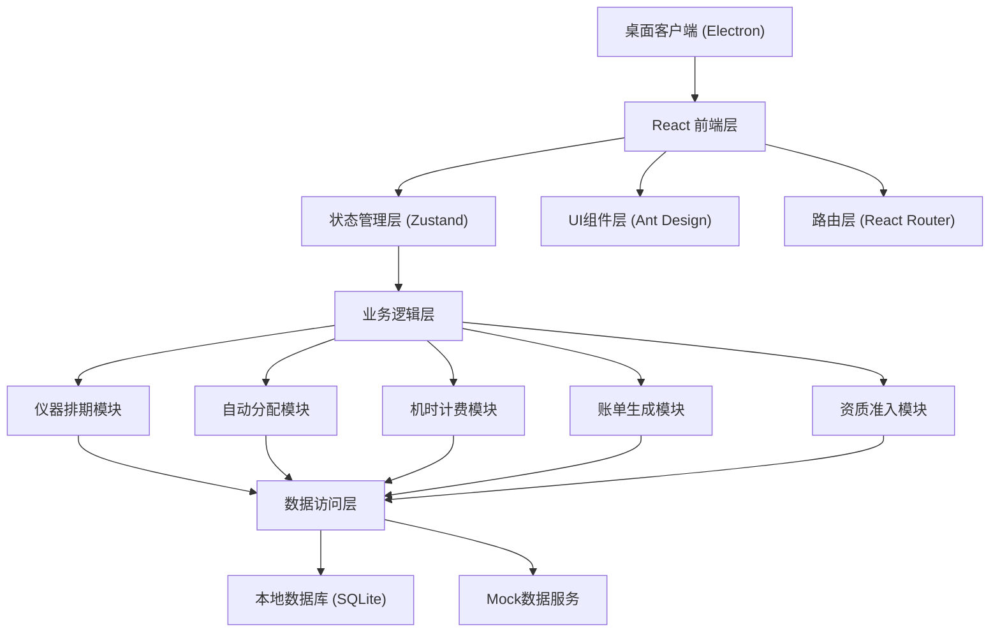
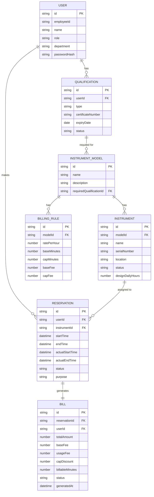

## 1. 架构设计



## 2. 技术描述

- **前端框架**：React@18 + TypeScript
- **桌面框架**：Electron@28
- **构建工具**：Vite@5 + electron-vite
- **状态管理**：Zustand@4
- **UI组件库**：Ant Design@5
- **路由**：React Router@6
- **本地数据库**：better-sqlite3
- **日期处理**：dayjs
- **图表**：@ant-design/charts
- **样式**：TailwindCSS@3

## 3. 目录结构

```
src/
├── main/                 # Electron 主进程
│   ├── index.ts         # 主进程入口
│   └── database.ts      # SQLite 数据库连接
├── renderer/            # React 渲染进程
│   ├── main.tsx         # 应用入口
│   ├── App.tsx          # 根组件
│   ├── router/          # 路由配置
│   ├── store/           # Zustand 状态管理
│   ├── components/      # 通用组件
│   ├── pages/           # 页面组件
│   ├── services/        # 业务服务
│   ├── utils/           # 工具函数
│   ├── types/           # TypeScript 类型定义
│   └── styles/          # 全局样式
└── shared/              # 主进程与渲染进程共享代码
    └── types.ts
```

## 4. 路由定义

| 路由 | 页面 | 权限 |
|------|------|------|
| /login | 登录页 | 公开 |
| /dashboard | 首页仪表盘 | 所有登录用户 |
| /schedule | 仪器排期页 | 所有登录用户 |
| /reservation | 预约申请页 | 科研人员 |
| /billing-rules | 计费规则页 | 管理员 |
| /bills | 账单管理页 | 财务人员、管理员 |
| /qualifications | 资质管理页 | 所有登录用户 |
| /instruments | 仪器管理页 | 管理员 |

## 5. 核心算法设计

### 5.1 负载均衡择优分配算法

```typescript
// 分配策略：
// 1. 筛选同型号、资质匹配、时间段空闲的仪器
// 2. 计算每台仪器的负载得分 = 7日使用时长 / 设计使用时长
// 3. 优先选择负载得分最低的仪器
// 4. 负载相同时选择累计使用次数最少的仪器
function allocateInstrument(
  modelId: string,
  startTime: Date,
  endTime: Date,
  userId: string
): Instrument | null {
  // 1. 筛选同型号仪器
  const candidateInstruments = instruments.filter(i => i.modelId === modelId);
  
  // 2. 资质校验
  const qualifiedInstruments = candidateInstruments.filter(i => 
    checkUserQualification(userId, i.requiredQualification)
  );
  
  // 3. 空闲校验
  const availableInstruments = qualifiedInstruments.filter(i => 
    isInstrumentAvailable(i.id, startTime, endTime)
  );
  
  // 4. 负载均衡排序
  const scored = availableInstruments.map(i => ({
    instrument: i,
    score: calculateLoadScore(i.id, startTime, endTime)
  }));
  
  // 5. 择优返回
  scored.sort((a, b) => a.score - b.score);
  return scored[0]?.instrument || null;
}
```

### 5.2 机时计费算法

```typescript
// 计费规则：
// 1. 实际使用时长 < 起步时长：按起步价收费
// 2. 起步时长 ≤ 实际使用时长 ≤ 封顶时长：按时长 × 单价收费
// 3. 实际使用时长 > 封顶时长：按封顶价收费
// 4. 精确到分钟，不足1分钟按1分钟计算
function calculateFee(
  actualDurationMinutes: number,
  ratePerHour: number,
  baseMinutes: number,
  capMinutes: number
): {
  totalFee: number;
  baseFee: number;
  usageFee: number;
  capDiscount: number;
  billableMinutes: number;
} {
  const roundedMinutes = Math.ceil(actualDurationMinutes);
  const ratePerMinute = ratePerHour / 60;
  
  let billableMinutes: number;
  let baseFee: number;
  let usageFee: number;
  let capDiscount: number;
  
  const baseFeeValue = baseMinutes * ratePerMinute;
  const capFeeValue = capMinutes * ratePerMinute;
  
  if (roundedMinutes < baseMinutes) {
    // 起步价
    billableMinutes = baseMinutes;
    baseFee = baseFeeValue;
    usageFee = 0;
    capDiscount = 0;
  } else if (roundedMinutes <= capMinutes) {
    // 正常计费
    billableMinutes = roundedMinutes;
    baseFee = baseFeeValue;
    usageFee = (roundedMinutes - baseMinutes) * ratePerMinute;
    capDiscount = 0;
  } else {
    // 封顶价
    billableMinutes = capMinutes;
    baseFee = baseFeeValue;
    usageFee = (capMinutes - baseMinutes) * ratePerMinute;
    const actualFee = roundedMinutes * ratePerMinute;
    capDiscount = actualFee - capFeeValue;
  }
  
  return {
    totalFee: baseFee + usageFee,
    baseFee,
    usageFee,
    capDiscount,
    billableMinutes
  };
}
```

## 6. 数据模型

### 6.1 数据模型定义



### 6.2 数据初始化脚本

```typescript
// Mock 数据初始化
export const mockUsers = [
  { id: '1', employeeId: 'R2024001', name: '张科研', role: 'researcher', department: '物理系' },
  { id: '2', employeeId: 'R2024002', name: '李教授', role: 'researcher', department: '化学系' },
  { id: '3', employeeId: 'A2024001', name: '王管理员', role: 'admin', department: '设备处' },
  { id: '4', employeeId: 'F2024001', name: '赵财务', role: 'finance', department: '财务处' },
];

export const mockInstrumentModels = [
  { id: 'M1', name: '透射电子显微镜', requiredQualificationId: 'Q1' },
  { id: 'M2', name: 'X射线衍射仪', requiredQualificationId: 'Q2' },
  { id: 'M3', name: '核磁共振仪', requiredQualificationId: 'Q3' },
];

export const mockInstruments = [
  { id: 'I1', modelId: 'M1', name: 'TEM-01', serialNumber: 'SN2023001', location: 'A座101', designDailyHours: 8 },
  { id: 'I2', modelId: 'M1', name: 'TEM-02', serialNumber: 'SN2023002', location: 'A座101', designDailyHours: 8 },
  { id: 'I3', modelId: 'M1', name: 'TEM-03', serialNumber: 'SN2023003', location: 'A座102', designDailyHours: 8 },
  { id: 'I4', modelId: 'M2', name: 'XRD-01', serialNumber: 'SN2023004', location: 'B座201', designDailyHours: 12 },
  { id: 'I5', modelId: 'M2', name: 'XRD-02', serialNumber: 'SN2023005', location: 'B座201', designDailyHours: 12 },
  { id: 'I6', modelId: 'M3', name: 'NMR-01', serialNumber: 'SN2023006', location: 'C座301', designDailyHours: 16 },
];

export const mockBillingRules = [
  { modelId: 'M1', ratePerHour: 300, baseMinutes: 30, capMinutes: 480, baseFee: 150, capFee: 2400 },
  { modelId: 'M2', ratePerHour: 150, baseMinutes: 15, capMinutes: 720, baseFee: 37.5, capFee: 1800 },
  { modelId: 'M3', ratePerHour: 500, baseMinutes: 60, capMinutes: 960, baseFee: 500, capFee: 8000 },
];
```

## 7. 模块接口定义

### 7.1 仪器排期模块

```typescript
interface ScheduleService {
  getInstruments(filter?: InstrumentFilter): Instrument[];
  getInstrumentSchedule(instrumentId: string, startDate: Date, endDate: Date): Reservation[];
  isInstrumentAvailable(instrumentId: string, startTime: Date, endTime: Date): boolean;
  getInstrumentLoad(instrumentId: string, days: number): number;
}
```

### 7.2 自动分配模块

```typescript
interface AllocationService {
  allocateInstrument(request: AllocationRequest): AllocationResult;
  checkUserQualification(userId: string, qualificationId: string): boolean;
  getAvailableInstruments(modelId: string, startTime: Date, endTime: Date): Instrument[];
  calculateLoadScore(instrumentId: string, startTime: Date, endTime: Date): number;
}
```

### 7.3 机时计费模块

```typescript
interface BillingService {
  calculateFee(reservationId: string, actualDurationMinutes: number): FeeCalculationResult;
  getBillingRule(modelId: string): BillingRule;
  calculateProRatedFee(reservationIds: string[], totalAmount: number): Map<string, number>;
}
```

### 7.4 账单生成模块

```typescript
interface BillService {
  generateBill(reservationId: string): Bill;
  getBills(filter?: BillFilter): Bill[];
  getBillDetail(billId: string): BillDetail;
  exportBill(billId: string, format: 'pdf' | 'excel'): Buffer;
}
```
